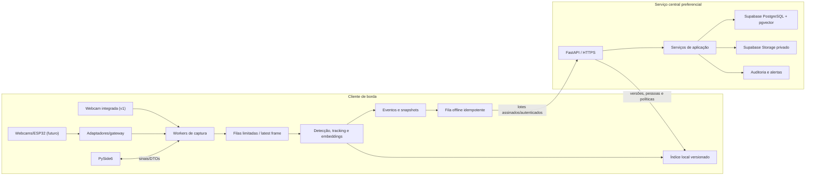
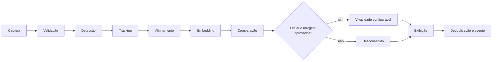
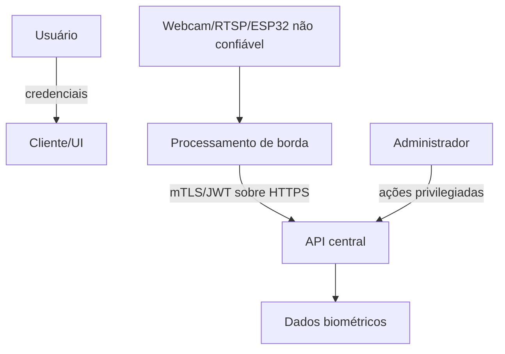

# Arquitetura inicial

## Visão geral

O repositório adota monólito modular. Há dois papéis de execução: **cliente de borda**,
que controla câmeras e reconhece localmente, e **servidor central**, que mantém estado
canônico, autenticação, políticas, sincronização e auditoria. Em uma instalação local,
os dois podem coexistir no mesmo computador sem remover a fronteira lógica.

## Topologia evolutiva confirmada

- **Primeira versão:** um computador, uma webcam integrada e reconhecimento local;
  a rede não participa da decisão a cada frame.
- **Central preferencial:** Supabase mantém metadados canônicos, pgvector e objetos
  privados, sujeito a prova de conceito de RLS, região, custo, backup e restauração.
- **Expansão:** cada webcam recebe worker/fila limitada; ESP32 é nó de
  captura/transporte e envia JPEG por conexão autenticada de saída ou gateway local.
- **Internet:** nenhum stream MJPEG do ESP32 é publicado diretamente. Chaves
  `service_role`/secret ficam somente no backend confiável, nunca no desktop ou ESP32.
- **Queda de rede:** inferência local continua e eventos entram em outbox SQLite
  idempotente; sincronização posterior usa backoff e limites.

## Módulos

- `configuration`: carregamento explícito, validação e defaults seguros.
- `cameras`: contratos e adaptadores USB/RTSP/arquivo/simulado.
- `recognition`: detecção, alinhamento, embeddings, matching e vivacidade.
- `services`: casos de uso sem dependência da GUI/HTTP.
- `database`/`repositories`: modelos, transações, migrações e consultas.
- `authentication`/`security`: credenciais, sessões, RBAC e criptografia.
- `synchronization`/`devices`: fila local, versões, heartbeat e conflitos.
- `api`: contratos HTTP, autenticação e health checks.
- `interface`: views PySide6; nunca executa captura/inferência na thread principal.
- `utils`: utilidades pequenas e sem regra de negócio.

## Pipeline facial

Cada embedding é acompanhado por `model_id`, versão, dimensão, normalização e data.
A melhor correspondência nunca basta: limiar absoluto, margem e política de
vivacidade determinam a classificação.

## Concorrência

| Responsabilidade | Estratégia | Motivo |
|---|---|---|
| Captura | thread/worker por câmera | I/O e chamadas nativas; falha isolável |
| Frame handoff | fila limitada, descarte do antigo | latência previsível e memória limitada |
| Inferência | worker/pool configurável | modelo compartilhado quando seguro; isolamento |
| Interface | thread principal Qt | requisito do toolkit e responsividade |
| API | asyncio/ASGI | muitas conexões I/O-bound |
| Banco | transações curtas por unidade de trabalho | integridade e contenção controlada |
| Sincronização | tarefa assíncrona com backoff+jitter | rede intermitente sem busy-loop |

`threading` é adequado a captura I/O/native; `multiprocessing` isola CPU/GIL e falhas,
mas duplica memória/modelos se mal configurado; `asyncio` serve I/O cooperativo, não
inferência bloqueante; processos externos facilitam supervisão; workers são unidades
escaláveis que devem receber mensagens limitadas e idempotentes.

## Dados e armazenamento

- Supabase/PostgreSQL é a fonte canônica relacional preferencial, ainda não validada.
- `pgvector` guarda vetores tipados e indexáveis próximos às permissões/metadados.
- Cliente mantém subconjunto autorizado e versionado; SQLite persiste a fila offline.
- Imagens são opcionais e vinculadas a eventos; Supabase Storage privado é a opção
  preferencial, com nomes gerados, metadados no banco, limites e URLs assinadas curtas.
- Backup do PostgreSQL não é tratado como backup dos objetos do Storage; restore e
  reconciliação dos dois conjuntos exigem testes separados.
- Gravação contínua não é presumida. Retenção, granularidade e base legal continuam
  `unspecified` e bloqueiam armazenamento comercial real.
- Logs nunca contêm senhas, tokens, URL RTSP completa ou embedding bruto.

## Sincronização offline

Todo evento recebe UUID no cliente, `device_id`, sequência monotônica local e hash do
payload canônico. O servidor possui unicidade por `(device_id, event_id)`. O cliente
envia lotes, confirma individualmente e repete com backoff; cadastros/embeddings usam
versão e cursor. Conflitos administrativos são registrados, não sobrescritos em silêncio.

## Tratamento de falhas

- Supervisor mantém estado individual por câmera e circuit breaker de reconexão.
- Recursos `VideoCapture`, threads e filas têm encerramento explícito e timeout.
- Queda do servidor move eventos para fila durável, sem bloquear reconhecimento.
- Falha de banco central degrada API e emite alerta; não confirma escrita não persistida.
- Falha de GPU tenta CPU apenas se política permitir e registra a mudança.

## Segurança, auditoria e trust boundaries

Fronteiras: câmera→cliente, arquivo importado→aplicação, cliente→API, API→banco,
operador→ações privilegiadas e processo→filesystem. Controles incluem validação,
RBAC deny-by-default, escopo por câmera/local, TLS, sessões curtas, rate limiting,
uploads fora da área pública, queries parametrizadas, auditoria append-oriented,
segredos externos e minimização/retencão.

Detalhes e fontes: `.planning/research/SECURITY_PRIVACY.md`.

## Contratos futuros

Interfaces previstas: `CameraSource`, `FaceDetector`, `EmbeddingProvider`,
`FaceMatcher`, `LivenessProvider`, `EventRepository`, `EmbeddingCache` e `SyncClient`.
Elas serão introduzidas na fase que realmente as usa, evitando abstrações vazias.
