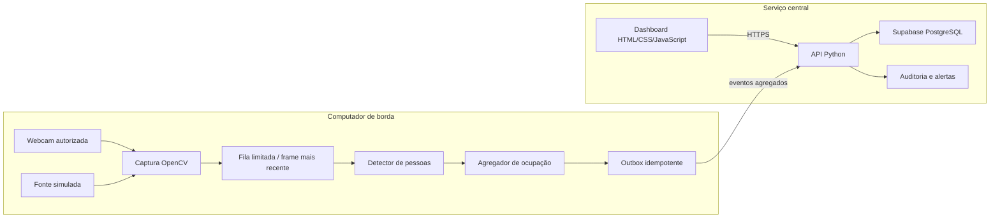
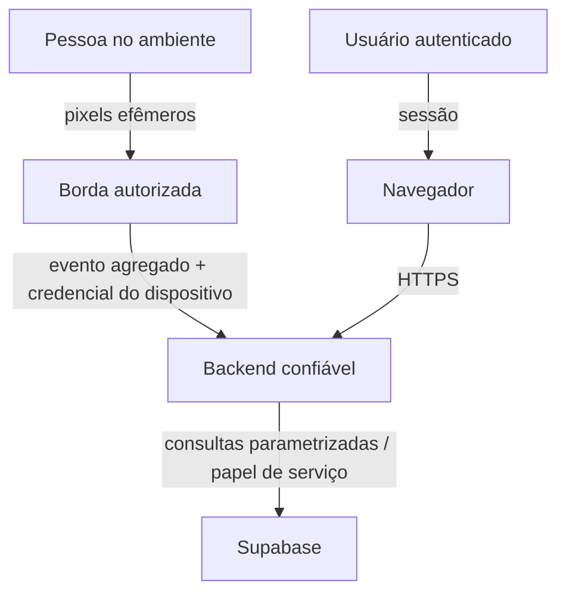

# Arquitetura — Smart Environment

Atualizado em: 2026-08-11
Estado: arquitetura-alvo; somente a fundação técnica existe no código

## Visão geral

O sistema mantém um monólito modular em um único repositório, com duas fronteiras de
execução. A **borda** controla a câmera e transforma frames efêmeros em observações sem
identificação. O **serviço central** recebe eventos agregados, aplica autorização e fornece
dados ao painel web. Na primeira instalação, borda e API podem rodar no mesmo computador.

## Regra arquitetural principal

Pixels entram na borda e não atravessam essa fronteira no baseline. O dado que sai é
um evento operacional minimizado. A rede nunca participa da decisão por frame.

## Fluxo do MVP

1. `CameraSource` entrega o frame mais recente a uma fila limitada.
2. O detector local encontra pessoas sem identificar quem são.
3. Um tracking curto e efêmero reduz contagens duplicadas dentro da janela atual.
4. O agregador converte observações em estado `empty`, `occupied` ou `unknown`, com
   contagem quando tecnicamente adequada e nível de confiança.
5. O evento recebe UUID, origem e janela temporal e entra na outbox local.
6. A API valida, autentica, autoriza e persiste idempotentemente no Supabase.
7. O dashboard consulta somente dados permitidos por organização e local.
8. O frame e qualquer identificador temporário de tracking são descartados.

## Contrato mínimo do evento de ocupação

| Campo lógico | Finalidade | Restrição |
|---|---|---|
| `event_id` | idempotência ponta a ponta | UUID gerado na borda |
| `organization_id` | isolamento do tenant | derivado de configuração autorizada |
| `environment_id` | ambiente observado | obrigatório e autorizado |
| `camera_id` | saúde e origem técnica | não identifica pessoa |
| `window_started_at` / `window_ended_at` | intervalo observado | UTC; janela finita |
| `occupancy_state` | vazio, ocupado ou desconhecido | `unknown` em falha/incerteza |
| `people_count` | contagem agregada opcional | nunca negativa; pode ser nula |
| `confidence` | qualidade técnica | não é confiança sobre identidade |
| `schema_version` | evolução segura | obrigatório |
| `created_at` | auditoria operacional | timestamp do recebimento |

Campos proibidos no evento baseline: nome, matrícula, `person_id`, face, embedding,
imagem, áudio, emoção, atenção, trajetória persistente ou rótulo de produtividade.

## Módulos planejados

- `configuration`: settings tipados e defaults seguros; já existe em forma inicial.
- `cameras`: contratos e adaptadores de fonte real e simulada.
- `occupancy`: detector, tracking efêmero, agregação e métricas de qualidade.
- `domain`: organização, local, ambiente, câmera, evento, patrimônio e alerta.
- `database`/`repositories`: transações, migrações, consultas e outbox.
- `api`: ingestão e consultas HTTP versionadas.
- `authentication`/`security`: Supabase Auth, RBAC, RLS e auditoria.
- `synchronization`/`devices`: idempotência, retry, heartbeat e configuração.
- `web`: aplicação no navegador e contratos com a API.
- `sustainability`: indicadores e estimativas com premissas explícitas.
- `assets`: inventário, zonas, estados e movimentações autorizadas.
- `alerts`: regras, deduplicação, confirmação e resolução.

As interfaces serão criadas somente na fase que as utiliza. A fundação atual não deve
receber abstrações vazias durante o replanejamento.

## Concorrência e recursos

| Responsabilidade | Estratégia alvo | Motivo |
|---|---|---|
| Captura | thread/worker por câmera | isolar I/O nativo e falha de dispositivo |
| Entrega de frames | fila limitada, descartar antigo | memória e latência previsíveis |
| Inferência | worker configurável CPU-first | não bloquear captura ou API |
| Agregação | janela curta e estado local limitado | evitar trajetória persistente |
| API | ASGI/async para I/O | conexões concorrentes sem misturar inferência |
| Banco | transações curtas | integridade e contenção |
| Sincronização | outbox com backoff e jitter | tolerar rede intermitente |

## Dados e armazenamento

- Supabase/PostgreSQL é o serviço central preferencial, ainda não validado por PoC.
- O esquema mínimo começa por organização, local, ambiente, câmera, evento de ocupação,
  usuário/papel e auditoria.
- SQLite é candidato para configuração e outbox local; não é fonte canônica global.
- Supabase Storage não é necessário para o MVP porque frames não são persistidos.
- `pgvector` não faz parte do baseline porque não há embeddings.
- Timestamps persistem em UTC; a apresentação aplica o fuso do local.
- Exclusão lógica não substitui retenção e eliminação verificável.

## Autenticação, autorização e fronteiras de confiança

Fronteiras: câmera→borda, configuração→processo, borda→API, navegador→API,
API→Supabase e administrador→ações privilegiadas. Controles alvo:

- negação por padrão, RBAC e escopo por organização/local;
- RLS como defesa adicional, não como substituta da autorização da aplicação;
- segredo `service_role` apenas no backend confiável, nunca no navegador ou câmera;
- TLS, validação de payload, rate limiting e queries parametrizadas;
- logs estruturados com allowlist e sem credenciais, pixels ou dados pessoais desnecessários;
- trilha de auditoria para configuração, acesso, exportação e resolução de alertas.

## Queda de rede e falhas

- A captura e a agregação continuam localmente dentro dos limites configurados.
- A outbox armazena apenas eventos agregados, com limite de tamanho e retenção.
- Reenvio usa o mesmo `event_id`; o servidor impede duplicação.
- Falha da câmera produz estado de saúde/`unknown`, nunca `empty` por presunção.
- Falha do detector degrada a leitura e alerta o operador; não fabrica contagem.
- Encerramento libera `VideoCapture`, workers, filas e conexões explicitamente.

## Sustentabilidade e patrimônio

Indicadores de sustentabilidade são derivados de ocupação e parâmetros declarados.
Até existirem medidores e calibração, o sistema apresenta **oportunidades estimadas**,
não economia comprovada. Recomendações exigem revisão humana.

Patrimônio começa como inventário e eventos de zona/estado. Uma futura detecção de
objetos exige dataset autorizado, licença comercial e métricas próprias. Um alerta de
movimentação nunca afirma automaticamente furto, culpa ou identidade.

## Evolução

- **Uma webcam:** primeira vertical real.
- **Múltiplas webcams/RTSP:** workers isolados após medir capacidade.
- **ESP32:** captura/transporte por conexão autenticada de saída; visão permanece no
  gateway quando o dispositivo não suportar o modelo.
- **Automação física:** somente após modo sugestão, piloto, override manual e fail-safe.
- **Identificação individual:** não faz parte do roadmap ativo; exige novo gate formal.

## Estado de implementação

Já existem apenas configuração mínima, diagnóstico, logging seguro e base de testes.
O smoke da webcam provou abertura de um frame em memória por DirectShow e liberação do
dispositivo; não existe captura contínua, detector, banco, API, Supabase ou dashboard.
