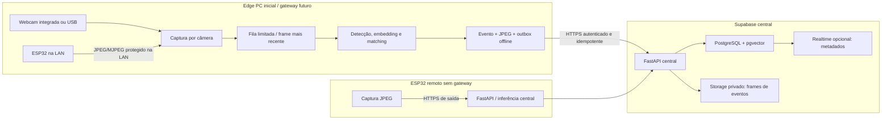

> [!IMPORTANT]
> **PESQUISA PARCIALMENTE HISTÓRICA desde 2026-08-11.** Supabase e ESP32 continuam
> direções possíveis, mas pgvector, biometria e Storage de frames saíram do baseline.
> Nenhuma PoC remota foi executada; revalidar cada decisão no roadmap `SE-*`.

# Supabase e ESP32-CAM — arquitetura de implantação (histórica/parcial)

**Projeto:** sistema multicâmera com reconhecimento facial
**Data de corte:** 2026-07-17
**Escopo:** adaptar a arquitetura às respostas operacionais do usuário, sem implementar
infraestrutura, firmware, banco ou reconhecimento nesta etapa
**Fontes:** apenas documentação oficial e repositórios primários da Supabase, Espressif e
pgvector, listados ao final

## 1. Como ler este documento

- **Fato:** afirmação explicitamente sustentada por uma fonte oficial/primária.
- **Inferência:** consequência técnica derivada dos fatos, ainda dependente de teste.
- **Decisão:** baseline recomendado para este projeto; não equivale a validação executada.
- **Lacuna:** dado ausente ou escolha que precisa de medição, governança ou aprovação.

Nenhum prazo de retenção, volume de pessoas, base legal, limiar biométrico, taxa de frames ou
capacidade de plano foi presumido. O cenário de TCC será projetado como **potencialmente
comercial**, mas isso não transforma um protótipo em produção autorizada.

## 2. Entradas normalizadas

| Entrada | Valor confirmado | Consequência imediata |
|---|---|---|
| Câmera inicial | uma webcam integrada ao próprio computador | captura e inferência podem ocorrer no mesmo PC |
| Expansão | várias webcams e nós de câmera baseados em ESP32 | fonte de câmera precisa ser um adaptador; concorrência e identidade não podem depender do índice `0` |
| Banco/serviços centrais | Supabase aceito | PostgreSQL gerenciado, pgvector e Storage tornam-se candidatos de implantação centrais |
| Rede | internet preferida; LAN também possível | operação offline e autenticação de dispositivo continuam necessárias |
| Imagens | usuário quer frames | baseline persiste **frames de eventos**, não gravação contínua |
| Finalidade declarada | TCC, tratado como potencialmente comercial | licenças, privacidade, controles e operação precisam de rigor de produção |

### Lacunas que permanecem abertas

1. “Quero frames” ainda não define se é um recorte facial, um frame completo ou uma sequência
   pré/pós-evento. Este documento adota somente o mínimo: um ou mais JPEGs associados a um
   evento, configuráveis e desligados por padrão até a política ser definida.
2. Retenção de eventos, objetos, embeddings, auditoria, cache e backups está **não definida**.
3. Quantidade futura de câmeras, pessoas, eventos/dia, FPS de análise, resolução, iluminação,
   banda e simultaneidade está **não definida**.
4. Modelo exato de placa, sensor, PSRAM, flash, fonte de alimentação e firmware ESP32 está
   **não definido**. “ESP32-CAM” não é uma especificação de hardware suficiente.
5. Hospedagem do FastAPI/inferência central, CPU/GPU, disponibilidade, orçamento, RPO e RTO
   estão **não definidos**. Supabase é o plano de dados recomendado, não o host presumido do
   processo Python.
6. Controlador, operadores, titulares, finalidade concreta, hipótese/base legal, necessidade,
   proporcionalidade, região de dados, contratos e processo de direitos estão **não definidos**.

## 3. Conclusão executiva

### Decisão principal

Adotar uma arquitetura híbrida em três estágios:

1. **Agora — webcam integrada:** OpenCV captura no PC; detecção, embedding e comparação
   acontecem no PC; somente eventos e seus JPEGs são sincronizados pela internet.
2. **Depois — várias webcams:** um worker e uma fila limitada `latest-frame` por câmera;
   inferência permanece no edge PC e a fonte canônica continua no Supabase.
3. **Depois — ESP32 com câmera:** o microcontrolador é, por padrão, nó de captura e transporte
   JPEG. Se houver um PC/gateway na LAN, ele recebe o stream e reconhece localmente. Sem
   gateway, o ESP32 envia amostras JPEG por HTTPS a um serviço de inferência central; somente
   o frame que resultar em evento é persistido.

O Supabase será usado como:

- PostgreSQL canônico para pessoas, dispositivos, câmeras, eventos, políticas e auditoria;
- pgvector para embeddings canônicos e consultas centrais;
- Storage em bucket privado para JPEGs de eventos;
- Auth/RLS para usuários e escopo de leitura;
- Realtime, se necessário, apenas para notificação/metadados de evento.

O Supabase **não substitui**:

- captura e inferência local da webcam;
- fila offline e índice local autorizado;
- serviço FastAPI de controle/ingestão e, no futuro, inferência de câmeras remotas;
- política de retenção, backup de objetos, licenciamento biométrico ou decisão jurídica.



## 4. Perfis de implantação

### 4.1 Perfil A — TCC com uma webcam

**Decisão**

- `CameraSource` inicial: webcam local, selecionada por configuração e descoberta; o índice de
  backend do OpenCV não será usado como identidade persistente.
- Um worker captura; a GUI recebe apenas DTOs/sinais e nunca executa inferência na thread Qt.
- Reconhecimento usa galeria local versionada. Não consulta a internet a cada frame.
- Quando há evento, grava primeiro em spool/outbox local idempotente; sincronização ocorre em
  segundo plano e não bloqueia a câmera.
- O payload persistível contém IDs pseudônimos, versão do modelo, score/distância, decisão,
  timestamps, `device_id`, `camera_id`, sequência, hash e referência do objeto. Nome de pessoa,
  token, embedding bruto e imagem não entram em logs.

**Inferência**

Esse perfil minimiza latência, egress e dependência de rede. Também permite demonstrar o TCC
com a internet indisponível, sem confundir indisponibilidade do Supabase com falha de
reconhecimento.

**Atalho de protótipo permitido, mas não preferido para o alvo comercial**

Se ainda não houver FastAPI hospedado, o desktop pode usar a Data API/Storage com chave
publicável, usuário autenticado e RLS. A Supabase documenta a chave publicável como própria
para desktop e afirma que a proteção depende de RLS e grants mínimos.[^supabase-keys]
Mesmo nesse perfil, chave secreta ou `service_role` no executável é proibida.

### 4.2 Perfil B — múltiplas webcams

**Decisão**

- um worker de captura e estado de saúde por câmera;
- fila pequena e limitada por câmera, descartando frames antigos para preservar latência;
- pool de inferência limitado por CPU/GPU e política explícita de fairness;
- `camera_id` estável gerado pelo sistema, separado de path USB, índice OpenCV e nome exibido;
- circuit breaker, reconexão com backoff e métricas por câmera;
- limites por instalação para FPS, resolução e quantidade de streams, definidos por benchmark.

**Lacuna**

Não há dados para escolher quantidade de workers, tamanho de fila ou FPS. Esses valores devem
vir de um teste com o hardware real, nunca de um default declarado como capacidade.

### 4.3 Perfil C — ESP32 com gateway na LAN

**Fato**

O driver oficial `esp32-camera` suporta ESP32, ESP32-S2 e ESP32-S3, vários sensores e captura
em formatos incluindo JPEG.[^esp-camera] O repositório fornece exemplos de captura JPEG e
stream MJPEG sobre HTTP.[^esp-camera]

**Decisão**

- usar JPEG no sensor sempre que a combinação suportar;
- manter o ESP32 em rede segmentada, sem exposição direta por port-forwarding;
- o gateway/edge PC consome o stream, reconhece, deduplica e persiste somente o evento;
- o adaptador ESP32 normaliza o stream para o mesmo contrato `CameraSource` das webcams;
- o exemplo HTTP oficial é referência funcional, não protocolo de produção. Autenticação,
  confidencialidade, timeout, limites, replay e identidade de dispositivo precisam ser
  adicionados ou terminados no gateway/VPN.

### 4.4 Perfil D — ESP32 remoto pela internet, sem gateway

**Decisão condicionada**

- o dispositivo inicia uma conexão HTTPS de saída; nenhum servidor MJPEG do ESP32 fica
  publicado na internet;
- envia JPEGs transitórios para um endpoint FastAPI autenticado, com `device_id`, sessão de
  boot, sequência monotônica, timestamp e hash;
- o FastAPI limita tamanho/taxa, valida JPEG, executa inferência em memória e descarta o frame
  quando não há evento;
- somente o JPEG de evidência aprovado pela política segue para Storage;
- falha de internet usa buffer pequeno e limitado. O sistema não promete reter um stream
  contínuo em flash.

**Fato**

O ESP-IDF recomenda TLS para comunicações externas e verificação da identidade do servidor por
certificado X.509.[^esp-security] O `ESP HTTP Client` oferece HTTPS com Mbed TLS e aceita CA ou
bundle X.509 para verificar o servidor.[^esp-http-client]

**Lacuna bloqueante**

Cadência de envio, resolução, qualidade JPEG, tolerância a perda, tamanho do buffer e custo de
banda dependem de placa, sensor, Wi-Fi e objetivo de reconhecimento. O perfil remoto não deve
entrar no roadmap de produção antes de um spike com hardware específico.

## 5. Supabase como plano de dados central

### 5.1 PostgreSQL

**Fato**

Cada projeto Supabase recebe um PostgreSQL completo; Auth, Storage, Realtime e Edge Functions
se apoiam nele.[^supabase-db] Os backups gerenciados do banco **não incluem os objetos do
Storage**, portanto backup de metadados não equivale a backup dos frames.[^supabase-db]

**Decisão**

Usar PostgreSQL como fonte canônica, com migrações versionadas. O desenho mínimo futuro deve
separar:

- `tenants`, `sites`, `users`, `roles` e vínculos de escopo;
- `devices`, `cameras`, credenciais/revogações e heartbeat;
- `persons`, `face_models`, `face_embeddings` e versões de galeria;
- `recognition_events` e decisões/revisões humanas;
- `frame_objects` com bucket, object key, hash, MIME, bytes, dimensões, estado e `expires_at`;
- `device_outbox_receipts`/chaves de idempotência;
- auditoria append-oriented.

`frame_objects` armazena a referência opaca do objeto, nunca uma URL assinada persistente.
`expires_at` pode existir no schema, mas seu valor/default permanece indefinido até aprovação
da política de retenção.

**Decisão de consistência**

Banco e Storage não devem ser tratados como uma única transação implícita. Reservar UUID e
object key, marcar estados `pending`/`uploaded`/`committed`, tornar reenvio idempotente e criar
reconciliação para objetos órfãos ou linhas sem objeto.

### 5.2 pgvector

**Fato**

O Supabase disponibiliza o tipo `vector` por meio da extensão pgvector.[^supabase-vector] O
pgvector oferece busca exata e índices aproximados; HNSW/IVFFlat introduzem trade-offs de
velocidade, memória e recall.[^pgvector]

**Decisão**

- pgvector guarda a cópia canônica dos embeddings junto a `model_id`, versão, dimensão,
  normalização, origem, status e escopo;
- o edge baixa apenas uma galeria autorizada e versionada para índice local;
- busca exata é o baseline inicial; HNSW só após cardinalidade e benchmark justificarem;
- embeddings de modelos/dimensões diferentes não são comparados;
- consulta remota ao pgvector nunca participa do loop de cada frame da webcam;
- threshold, margem para segundo colocado e política de vivacidade são externos ao índice.

**Inferência**

Com uma webcam e uma galeria pequena, um índice aproximado aumenta complexidade sem evidência
de benefício. Quando a escala crescer, recall aproximado deve ser comparado à busca exata,
como recomenda a documentação primária do pgvector.[^pgvector]

### 5.3 Storage para frames de eventos

**Fato**

Buckets privados são o default do Supabase Storage e submetem download e demais operações a
RLS; buckets públicos tornam a leitura acessível a qualquer pessoa que tenha a URL.[^storage-buckets]
O Storage permite limitar MIME e tamanho por bucket.[^storage-buckets] URLs assinadas de
download têm validade limitada, mas continuam válidas até expirar mesmo após rotação de chaves
Auth; a documentação orienta contatar o suporte para revogação.[^storage-download]

**Decisão**

- bucket `event-frames` privado; nunca público;
- aceitar inicialmente somente JPEG canônico validado, com limite de bytes menor possível,
  definido depois de medir resolução/qualidade reais;
- object key gerada pelo servidor, por exemplo
  `tenant_id/site_id/camera_id/yyyy/mm/event_uuid/frame_uuid.jpg`, sem nomes de pessoas;
- upload sem `upsert`, para que o mesmo path não seja silenciosamente sobrescrito;
- download autenticado ou URL assinada criada just-in-time pelo backend, com o menor TTL
  operacional aprovado;
- não registrar URL assinada nem retorná-la a usuários sem permissão de leitura do evento;
- exclusão/retenção deve abranger objeto, linha, caches, filas e restore; nenhum prazo é definido
  aqui;
- backup/restore de objetos deve ser projetado separadamente do backup PostgreSQL.

**Opção de escala**

O FastAPI pode receber o JPEG e repassá-lo ao Storage no primeiro piloto. Depois, pode emitir
uma URL de upload assinada para um **path exato**, após autenticar e autorizar o dispositivo,
reduzindo banda no backend. A URL assinada de upload dispensa autenticação adicional e a
documentação atual informa validade de duas horas; portanto ela é um bearer token e não deve
ser logada ou pré-gerada em massa.[^storage-signed-upload]

### 5.4 RLS, grants e separação de tenants

**Fato**

Na Data API, grants definem quais objetos cada role alcança e RLS define quais linhas pode
ler/alterar.[^supabase-api-security] Chaves secretas e `service_role` ignoram RLS e só são
seguras no backend.[^supabase-secure-data]

**Decisão**

- RLS `deny-by-default` em toda tabela exposta e em `storage.objects`;
- políticas filtram no mínimo tenant/site/câmera e ação; não apenas `user_id`;
- grants mínimos por `anon`/`authenticated`; `anon` não lê biometria, evento ou frame;
- testes negativos cobrem BOLA/IDOR trocando `tenant_id`, `site_id`, `camera_id`, `event_id` e
  object key;
- tabelas internas ficam em schema não exposto ou a Data API é desabilitada quando somente o
  FastAPI usa conexão direta;
- o backend de rotina usa role PostgreSQL de menor privilégio quando possível;
- uma credencial elevada separada fica restrita a operações administrativas/Storage que
  realmente a exijam.

RLS não compensa um backend que usa credencial com `BYPASSRLS`. Nesse caminho, autorização no
FastAPI e seus testes são controles obrigatórios, e não opcionais.

### 5.5 `service_role`, chaves secretas e clientes de borda

**Fato**

Em 2026, a Supabase documenta `anon`/`service_role` como chaves legadas, com depreciação até o
fim de 2026, e recomenda `sb_publishable_...`/`sb_secret_...` para novos projetos.[^supabase-keys]
A chave secreta e a `service_role` possuem acesso elevado e bypass de RLS.[^supabase-keys]

**Decisão não negociável**

- não embarcar `service_role`, `sb_secret`, senha PostgreSQL ou segredo de assinatura no
  desktop distribuído, firmware ESP32, repositório, logs ou pacote de instalação;
- edge PC e ESP32 recebem identidade própria, escopo mínimo e credencial revogável/rotacionável;
- somente FastAPI/worker confiável acessa segredo Supabase via secret manager;
- preferir a nova chave secreta em integrações novas, sem criar dependência adicional da chave
  `service_role` legada;
- separar cliente Supabase administrativo do cliente que propaga JWT de usuário, evitando que
  sessão substitua silenciosamente o contexto esperado;
- rotacionar após suspeita de exposição e manter inventário de onde cada credencial existe.

### 5.6 Conexão segura e pooling

**Fato**

O Supabase recomenda conexão PostgreSQL com SSL e permite exigir SSL no projeto. Para
`verify-full`, é necessário baixar a CA do banco.[^supabase-ssl] As APIs HTTP de Auth, Storage
e PostgREST exigem SSL; a exigência configurável citada se aplica às conexões PostgreSQL e
poolers.[^supabase-ssl]

O modo recomendado varia com o cliente:[^supabase-connect]

- conexão direta: backend persistente e ferramentas, via IPv6 ou add-on IPv4;
- Supavisor session mode: backend persistente em rede IPv4-only;
- transaction mode: funções serverless/temporárias; não suporta prepared statements.

**Decisão**

- ativar enforcement de SSL no projeto e usar validação de CA/hostname (`verify-full`) no
  FastAPI/SQLAlchemy;
- FastAPI persistente usa conexão direta quando houver IPv6; caso contrário, Supavisor session
  mode;
- Edge Functions/serverless usam transaction mode e driver configurado sem prepared statements;
- desktop e ESP32 não abrem conexão PostgreSQL direta pela internet;
- ESP32 valida o certificado do endpoint HTTPS; opções de “skip verification” ficam proibidas
  fora de harness local descartável;
- timeouts, backoff com jitter, circuit breaker e limites de pool são obrigatórios.

### 5.7 Região

**Fato**

Cada projeto Supabase tem uma região primária, e `sa-east-1` (São Paulo) aparece entre as
regiões específicas disponíveis na data de corte.[^supabase-regions]

**Decisão condicionada**

São Paulo é o candidato inicial de latência para um piloto brasileiro, mas a escolha final
depende de localização dos usuários, custo, contratos, transferência, requisitos jurídicos e
plano de recuperação. Região próxima não define base legal nem conformidade por si só.

## 6. Frames, armazenamento, banda e Realtime

### 6.1 O que é persistido

**Decisão**

Separar duas classes:

1. **frame de transporte:** usado transitoriamente para inferência e descartado quando não gera
   evento;
2. **frame de evidência do evento:** objeto privado com referência e política de retenção.

Não enviar stream contínuo ao Storage, não colocar JPEG/bytes em linha PostgreSQL e não usar
Realtime como transporte de imagem.

### 6.2 Capacidade e custo

**Fato**

Storage, banco, egress, Realtime e compute têm quotas dependentes do plano. Na data de corte, a
tabela oficial informa para o plano Free 1 GB de Storage, banco de 500 MB e 5 GB de egress; os
valores e preços precisam ser rechecados antes de cada piloto.[^supabase-billing] Egress é dado
transmitido para fora dos serviços Supabase, inclusive Storage, banco e Realtime.[^supabase-egress]

**Decisão**

Dimensionar com medições, usando ao menos:

```text
storage_novo_por_mes = eventos_mes × frames_por_evento × bytes_JPEG_médios
storage_estável       = função(storage_novo_por_mes, retenção_e_exclusões)
egress_frames         = downloads_mes × bytes_JPEG_médios
banda_ESP_remoto      = amostras_por_segundo × bytes_JPEG_médios × segundos_conectado
```

Sem retenção, armazenamento cresce sem limite. Sem média real de JPEG e contagem de eventos,
não é possível afirmar que o plano Free atende nem estimar custo comercial.

### 6.3 Realtime

**Fato**

A Supabase recomenda Broadcast para maior escala/segurança; Postgres Changes é mais simples,
mas escala pior.[^supabase-realtime] A documentação atual limita payload de Postgres Changes a
1.024 KB em todos os planos listados.[^supabase-realtime-limits]

**Decisão**

- Realtime é opcional no perfil de uma câmera;
- quando ativado, publica somente `event_id`, `camera_id`, estado, severidade e timestamp;
- UI autorizada busca metadados e solicita URL assinada separadamente;
- usar canais privados e RLS de autorização;
- adotar Broadcast quando notificações precisarem escalar; não transmitir embeddings ou JPEGs;
- benchmark e quota alert devem preceder aumento de câmeras.

## 7. ESP32: fatos, limites e fronteira do reconhecimento

### 7.1 Captura oficial

**Fatos**

- `esp32-camera` suporta ESP32, ESP32-S2 e ESP32-S3 e uma matriz específica de sensores.[^esp-camera]
- fora de CIF ou resolução menor com JPEG, o driver requer PSRAM instalada/ativada; YUV/RGB
  pressiona o chip e pode perder dados, especialmente com Wi-Fi.[^esp-camera]
- dois ou mais frame buffers elevam FPS, mas pressionam CPU/memória e são recomendados somente
  com JPEG.[^esp-camera]
- as famílias variam: a comparação oficial lista 520 KB de SRAM no ESP32 clássico e 512 KB no
  ESP32-S3, além de diferenças de CPU, RAM externa e periféricos.[^esp-chip-matrix]

**Decisão**

O contrato de compatibilidade deve registrar SoC, módulo, sensor, PSRAM/flash, resolução, JPEG
quality, buffers, versão ESP-IDF/driver, alimentação e Wi-Fi. “Funciona em ESP32-CAM” não será
critério de aceite.

### 7.2 Reconhecimento facial no microcontrolador

**Fato importante**

ESP-WHO é uma plataforma oficial de visão que possui exemplos de detecção e reconhecimento
facial, e a placa ESP32-S3-EYE é entregue com firmware de demonstração capaz de reconhecer
IDs locais.[^esp-who][^esp-s3-eye] Portanto, é incorreto afirmar que reconhecimento em ESP32 é
impossível.

Também é fato que o branch atual do ESP-WHO lista placas específicas e informa que ESP32 e
ESP32-S2 não estão disponíveis nesse branch no momento.[^esp-who] A capacidade de uma
ESP32-S3-EYE não pode ser extrapolada para uma placa genérica, sensor desconhecido ou para o
pipeline ONNX escolhido neste projeto.

**Decisão**

Não presumir reconhecimento no ESP32 no baseline. O microcontrolador captura/transmite; o
matching fica:

- no edge PC para webcam ou ESP32 na LAN; ou
- em serviço Python central para ESP32 remoto sem gateway.

**Justificativa por inferência**

1. O projeto precisa de um único contrato de embedding, `model_id`, calibração, margem,
   vivacidade, auditoria e atualização; o demo ESP-WHO não prova equivalência ao modelo ONNX.
2. CPU/RAM/PSRAM, sensor e suporte variam fortemente entre placas; o driver já alerta para
   pressão de memória e Wi-Fi durante captura.
3. Galeria maior, múltiplos rostos, PAD e atualização segura competem com captura e rede.
4. Edge PC/servidor permite medir o mesmo pipeline, atualizar modelo e revogar galeria sem
   criar um segundo mecanismo biométrico implícito.

Reconhecimento on-device pode virar um **spike futuro separado**, somente com placa definida,
modelo/licença aprovados e métricas comparáveis. O aceite exigiria latência, FPS, FMR/FNMR,
consumo, temperatura, estabilidade Wi-Fi, tamanho máximo de galeria, PAD, atualização assinada
e comportamento offline. Um demo não satisfaz esses critérios.

## 8. Fluxos recomendados

### 8.1 Evento originado no PC

1. Captura e inferência local produzem uma decisão probabilística.
2. Deduplicador decide se há evento; não salva cada frame analisado.
3. Cliente gera UUID, sequência, hash e JPEG canônico conforme política.
4. Outbox local persiste metadados e arquivo com quota.
5. Sync autentica o dispositivo no FastAPI e envia lote idempotente.
6. Backend autoriza tenant/site/câmera, valida limites e reserva object key.
7. Frame vai ao bucket privado; metadado é confirmado no PostgreSQL.
8. Realtime opcional notifica apenas o ID do evento.
9. Leitura do frame exige autorização e URL assinada curta.

### 8.2 Frame originado no ESP32 remoto

1. ESP32 captura JPEG e abre HTTPS de saída com servidor verificado.
2. Envia amostra com identidade, sessão, sequência, timestamp e hash.
3. FastAPI aplica autenticação, rate limit, limite de bytes e validação do JPEG.
4. Serviço de inferência processa em memória.
5. Sem evento: descarta; com evento: executa o fluxo de persistência acima.
6. Falha/replay não duplica evento devido à chave idempotente.

## 9. Segurança e privacidade para cenário potencialmente comercial

### Decisões de engenharia

- dados e objetos privados por padrão;
- frames completos, recortes e armazenamento de desconhecidos são feature gates separados;
- nenhuma decisão adversa totalmente automatizada com base no reconhecimento;
- revisão humana e correção auditável para casos ambíguos/alto impacto;
- secrets fora de edge e firmware distribuído;
- TLS com verificação, rotação de credencial e revogação por dispositivo;
- secure boot, flash encryption e OTA assinada entram no baseline comercial do firmware, após
  seleção da placa;
- exportação e leitura em massa exigem autorização reforçada e auditoria;
- retenção e exclusão testadas entre PostgreSQL, Storage, cache, outbox e backup.

### Lacunas de governança — bloqueiam piloto com biometria real

- finalidade concreta e necessidade do reconhecimento;
- controlador, operador(es), responsáveis e contratos;
- hipótese/base legal por operação e tratamento de desconhecidos;
- política de retenção por classe e justificativa;
- aviso, transparência, direitos e revisão humana;
- RIPD/avaliação jurídica quando aplicável;
- região, DPA, subprocessadores, transferência e resposta a incidente;
- licença comercial do código, modelo e pesos biométricos.

O DPA oficial atual da Supabase inclui uma definição de dados biométricos, mas um contrato com
o fornecedor não escolhe nem prova a base legal do projeto.[^supabase-dpa] O bloqueio de
licença dos pesos faciais registrado na pesquisa principal permanece válido para este cenário.

## 10. Plano recomendado de validação

### P0 — antes de qualquer frame biométrico real

| ID | Tarefa | Evidência esperada |
|---|---|---|
| SE-01 | fechar significado de “frames” e política de retenção | decisão aprovada para recorte/full-frame/quantidade e eliminação |
| SE-02 | definir projeto Supabase, região e ambiente separado | decisão registrada; sem credencial em repositório |
| SE-03 | modelar schema, migrations, grants e RLS | testes positivos e negativos por tenant/site/câmera |
| SE-04 | criar bucket privado com MIME/tamanho limitados | URL pública falha; upload inválido falha; leitura autorizada funciona |
| SE-05 | implementar broker de Storage e signed URLs | nenhuma chave elevada no cliente; URL não aparece em logs |
| SE-06 | implementar identidade de dispositivo e ingestão idempotente | replay não duplica evento; dispositivo revogado falha |
| SE-07 | fechar governança e licença | checklist jurídico/privacidade e licença dos pesos aprovados |

### P1 — piloto da webcam integrada

| ID | Tarefa | Evidência esperada |
|---|---|---|
| SE-08 | captura/inferência local com outbox | reconhecimento continua durante queda de internet |
| SE-09 | sincronizar evento + JPEG | objeto e linha reconciliados; hash e limites validados |
| SE-10 | medir carga real | JPEG médio, eventos/dia, upload, download, storage e egress registrados |
| SE-11 | restaurar dados e objetos | restore documentado; ausência de objetos no backup DB tratada |

### P2 — expansão

| ID | Tarefa | Evidência esperada |
|---|---|---|
| SE-12 | teste de múltiplas webcams | fairness, memória, latência e reconexão por câmera |
| SE-13 | spike ESP32 LAN | matriz de placa/sensor/PSRAM, FPS, perdas e segurança |
| SE-14 | spike ESP32 remoto | banda, latência, autenticação, replay e falha de rede |
| SE-15 | avaliar Realtime | apenas metadata; quota/lag e RLS medidos |
| SE-16 | avaliar reconhecimento ESP-WHO opcional | comparação completa, sem presumir paridade |

## 11. Critérios de aceite arquiteturais

- [ ] Uma webcam integrada opera e reconhece sem conexão com Supabase.
- [ ] Queda de internet não bloqueia captura nem perde eventos dentro da quota local definida.
- [ ] Nenhuma chave `service_role`/secreta ou senha PostgreSQL existe em desktop/ESP32.
- [ ] Bucket de frames é privado e políticas negam leitura cruzada por tenant/site/câmera.
- [ ] JPEG inválido, grande demais, MIME incorreto, replay e object key fora do escopo falham.
- [ ] Banco e Storage são reconciliáveis após falha parcial.
- [ ] URL assinada é emitida somente após autorização e não persiste em banco/log.
- [ ] Retenção aprovada elimina linha, objeto, cache/outbox e trata backup/restore.
- [ ] pgvector registra modelo/dimensão/versão; o edge não consulta a nuvem por frame.
- [ ] Realtime, se usado, carrega apenas metadados pequenos.
- [ ] ESP32 remoto usa HTTPS de saída com certificado de servidor verificado.
- [ ] Nenhum exemplo HTTP da Espressif é exposto diretamente à internet.
- [ ] Placa/sensor ESP32 passam matriz de compatibilidade e benchmark antes de suporte declarado.
- [ ] Reconhecimento no ESP32 continua fora do baseline até spike específico aprovado.
- [ ] Licença comercial dos pesos/modelos e governança de biometria estão aprovadas antes do
  piloto com terceiros.

## 12. Decisões consolidadas

| Tema | Decisão | Estado |
|---|---|---|
| Primeira fonte | webcam integrada no edge PC | adotada |
| Escala de webcam | worker/fila limitada por câmera | adotada, parâmetros pendentes |
| Banco central | Supabase PostgreSQL | adotada como implantação candidata |
| Vetores | pgvector canônico + cache/índice local versionado | adotada |
| Imagens | Storage privado para frames de eventos | adotada, formato/quantidade/retenção pendentes |
| API | FastAPI como controle/ingestão; host ainda não escolhido | adotada com lacuna de deploy |
| Credencial elevada | somente backend confiável; nova secret key preferida | adotada |
| Internet | HTTPS de saída; operação offline no edge | adotada |
| ESP32 | captura/transporte JPEG por padrão | adotada |
| Reconhecimento ESP32 | fora do baseline; spike futuro | adotada |
| Realtime | opcional e apenas metadados | adiada |
| HNSW | somente após benchmark/cardinalidade | adiada |
| Retenção/base legal | não inventar; bloqueio de governança | aberta/bloqueante |

## 13. Evidência e limitações

- Nenhum projeto Supabase foi criado ou conectado.
- Nenhuma região, plano, quota, credencial, migration, tabela, bucket ou política foi aplicada.
- Nenhuma webcam, placa ESP32, sensor, stream ou endpoint foi testado.
- Nenhum frame, rosto, embedding ou dado pessoal foi coletado.
- Nenhum benchmark de CPU/GPU, rede, JPEG, pgvector, RLS, Realtime ou Storage foi executado.
- Nenhuma afirmação de conformidade, base legal, retenção adequada ou licença de produção é
  feita neste documento.
- Quotas, preços, produtos e chaves da Supabase mudam; o snapshot deve ser revalidado antes do
  piloto e do go-live.

## 14. Fontes oficiais e primárias

Todas as fontes abaixo foram consultadas em 2026-07-17.

[^supabase-db]: Supabase — [Database overview](https://supabase.com/docs/guides/database/overview).
[^supabase-connect]: Supabase — [Connect to your database](https://supabase.com/docs/guides/database/connecting-to-postgres).
[^supabase-ssl]: Supabase — [Postgres SSL Enforcement](https://supabase.com/docs/guides/platform/ssl-enforcement).
[^supabase-keys]: Supabase — [Understanding API keys](https://supabase.com/docs/guides/getting-started/api-keys).
[^supabase-secure-data]: Supabase — [Securing your data](https://supabase.com/docs/guides/database/secure-data).
[^supabase-api-security]: Supabase — [Securing your API](https://supabase.com/docs/guides/api/securing-your-api).
[^supabase-vector]: Supabase — [Vector columns / pgvector](https://supabase.com/docs/guides/ai/vector-columns).
[^pgvector]: pgvector — [repositório e documentação primária](https://github.com/pgvector/pgvector).
[^storage-buckets]: Supabase — [Storage Buckets](https://supabase.com/docs/guides/storage/buckets/fundamentals) e [Storage Access Control](https://supabase.com/docs/guides/storage/security/access-control).
[^storage-download]: Supabase — [Serving assets from Storage](https://supabase.com/docs/guides/storage/serving/downloads).
[^storage-signed-upload]: Supabase — [createSignedUploadUrl](https://supabase.com/docs/reference/javascript/file-buckets-createsigneduploadurl) e [Resumable Uploads](https://supabase.com/docs/guides/storage/uploads/resumable-uploads).
[^supabase-billing]: Supabase — [About billing on Supabase](https://supabase.com/docs/guides/platform/billing-on-supabase) e [Storage upload limits](https://supabase.com/docs/guides/storage/uploads/file-limits).
[^supabase-egress]: Supabase — [Manage Egress usage](https://supabase.com/docs/guides/platform/manage-your-usage/egress).
[^supabase-realtime]: Supabase — [Subscribing to Database Changes](https://supabase.com/docs/guides/realtime/subscribing-to-database-changes).
[^supabase-realtime-limits]: Supabase — [Realtime Limits](https://supabase.com/docs/guides/realtime/limits).
[^supabase-regions]: Supabase — [Available regions](https://supabase.com/docs/guides/platform/regions).
[^supabase-dpa]: Supabase — [Data Processing Addendum, versão de 2026-06-01](https://supabase.com/downloads/docs/Supabase%2BDPA%2B260601.pdf).
[^esp-camera]: Espressif — [`esp32-camera`, driver oficial e exemplos](https://github.com/espressif/esp32-camera).
[^esp-security]: Espressif — [ESP-IDF Security Overview](https://docs.espressif.com/projects/esp-idf/en/latest/esp32/security/security.html) e [ESP-TLS](https://docs.espressif.com/projects/esp-idf/en/stable/esp32/api-reference/protocols/esp_tls.html).
[^esp-http-client]: Espressif — [ESP HTTP Client](https://docs.espressif.com/projects/esp-idf/en/stable/esp32/api-reference/protocols/esp_http_client.html).
[^esp-chip-matrix]: Espressif — [Chip Series Comparison](https://docs.espressif.com/projects/esp-idf/en/v5.0/esp32s3/hw-reference/chip-series-comparison.html).
[^esp-who]: Espressif — [`esp-who`, framework oficial de detecção e reconhecimento](https://github.com/espressif/esp-who).
[^esp-s3-eye]: Espressif — [ESP32-S3-EYE Getting Started Guide](https://github.com/espressif/esp-who/blob/master/docs/en/get-started/ESP32-S3-EYE_Getting_Started_Guide.md).
